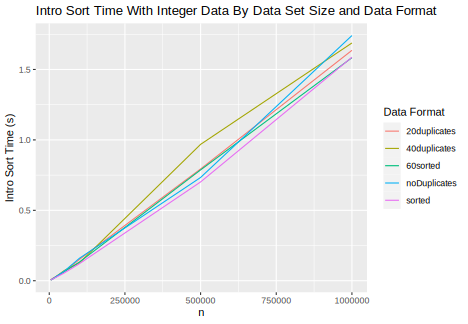
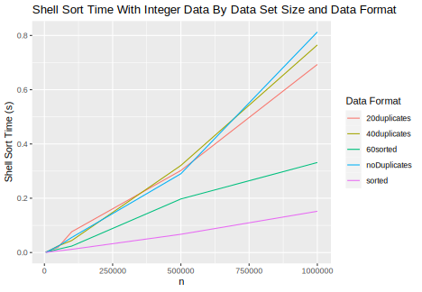
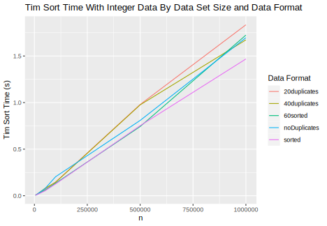
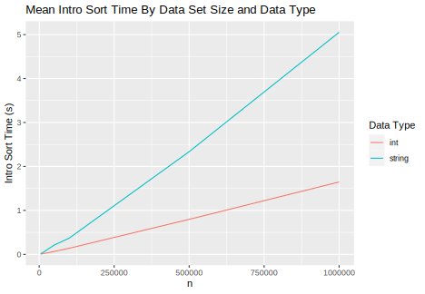
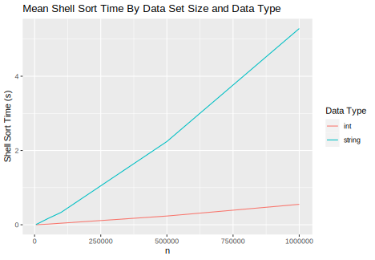
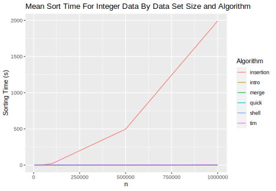
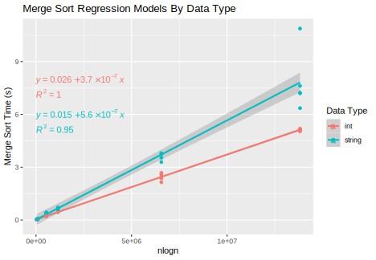
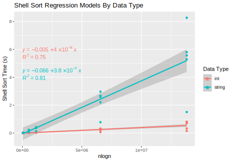

# Spring 2022 CS 3353 PA02 - Sorting Algorithms
## The Fontenauts - Wes Anderson and Ryan Schaefer

## The Problem

In this project we were tasked with implementing six sorting algorithms : insertion, intro, merge, quick, shell, and tim. We then generated both integer and string datasets of differing sizes that fall into five categories -  0% duplicates, 20% duplicates, 40% duplicates, 60% sorted, and 100% sorted. Using the chrono library we ran our generated datasets through the sorting algorithms and tracked the times. In our analysis section we use the data generated and describe under what scenarios different algorithms perform better or worse.

## Building and Running the Program

Step 1: Navigate to the Working Directory

In your command line, use cd statements to navigate to the folder generated by opening the zip file containing this program.

Step 2: Create a Build Folder

Enter ```mkdir build``` into the command line to create a new folder called *build* which will be used for building and eventually running the program. Enter the folder with ```cd build```.

Step 3: Configure the Build

Enter ```cmake ..``` into the command line to configure the build folder. This will generate all of the files needed to build and run this program.

Step 4: Build the Program

Enter ```cmake -–build .``` into the command line to build the program. This will create an executable file to run this program.

Step 5: Run the Program

Enter ```./PA02 input/``` to run the program. During our testing insertion sort took 5-10 hours to sort the 1 million string datasets. If you would like to skip running insertion sort please enter ```./PA02 input/ -i``` to run the program.

## Data Generation

To generate the random data for this project, we wrote a JavaScript program and used the fs and chance libraries. In this program, we created an array with all of the data set sizes we wanted and had nested for loops, with the outer loop iterating twice (for ints and strings) and the inner loop iterating through each value in the array of sizes. Inside these loops, we called a series of functions, each designed to generate the data for a different file format. To be more efficient, we had these functions call each other. For example, the sorted function calls the no duplicates function and sorts it at the end. This means that the no duplicates function is used to make all of the data sets. For the integer data, it creates an array with all values from 0 to the array size - 1 and then mixes the values. For string data, it uses the chance library to create an array of the given size with random strings. After each data set is created, it is outputted to a .txt file with 1 value on each line using the fs library. All of the output files are named based on which data set is in that file.

## Analysis

### Randomized vs Presorted vs Semisorted

For all sorting algorithms the presorted data was the best case scenario. However the magnitude difference was only noticable for insertion and shell sort. For semisorted data the difference in magnitude was also only noticeable for insertion and shell sort. The difference was less noticeable for shell sort than with the fully sorted dataset.

Note - The graphs below show only the integer data collected. The string data shows the same trends on a larger timescale. If you would like to view them please look in the data folder.








### Duplicates

From the graphs shown above we can also see that the sorts handle duplicates rather well. While there is a little variance in the timings between the 0%, 20%, and 40% duplicate datasets, the magnitudes of the times were on the same scale. The variance is most likely due to the data being ordered in a way that is slightly better or worse for the algorithms.

### String vs Ints

As seen in the graphs below for all sorting algorithms the time to sort a string dataset was significantly longer than the time to sort the corresponding integer dataset.








### Large Datasets

For large datasets quick sort and shell sort function very well at under 1 second for 1 million ints and under 10 seconds for 1 million strings. Merge, intro, and tim sort were all in the same range and functioned slightly worse than quick and shell sorts. Insertion sort was by far the worst, taking over 5 hours on one testing machine and over 10 on another testing machine when sorting 1 million strings.




### Upper Bounds







...Using the coefficients we can see that quick sort is the best... (for section below)

### Best Algorithm

From the data we collected the best sorting algorithm is quick sort. The graphs below show all sorting algorithm average times except insertion as it was magnitudes above all others. In both integers and strings, quick sort is shown to have the fastest sorting time proving it is the best of the algorithms we implemented


